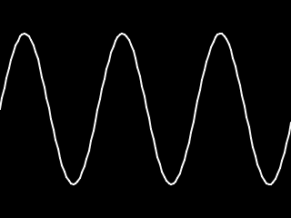
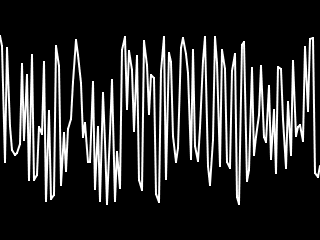

# shiomi

[](https://github.com/akiomik/shiomi/actions/workflows/go.yml)

shiomi (潮見) is an oscilloscope-like audio waveform GIF animation generator.

## Installation

```sh
go get github.com/akiomik/shiomi
```

## Usage

```sh
shiomi -i input.wav -o output.gif -f 1000 # 1kHz
```

## Example

commands:

```sh
shiomi -i test/data/sine-44.1kHz-16bit-1kHz-3s.wav -o sine.gif -f 1000
```

outputs:



commands:

```sh
shiomi -i test/data/noise-44.1kHz-16bit-white-3s.wav -o noise.gif
```

outputs:


